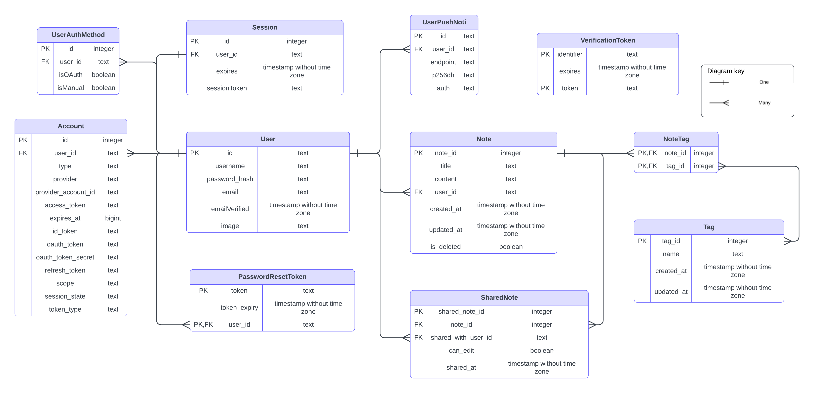
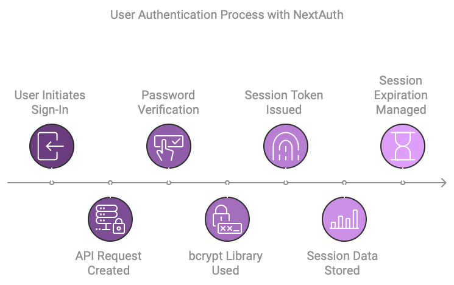
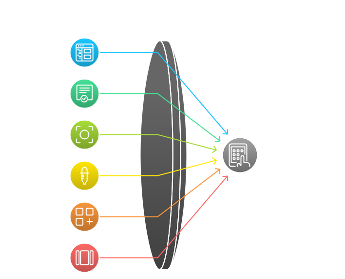
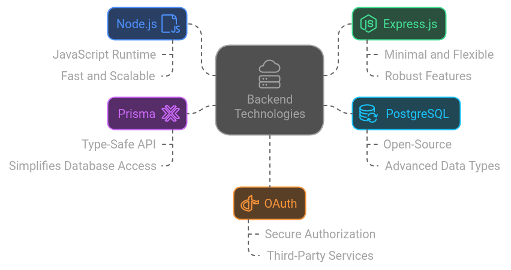

# Bronotion

### CS343 Stellenbosch University  
**Group 37**

| **Name**          | **Student Number** |
|-------------------|--------------------|
| Justin Dietrich   | 25924958           |
| Jonathan Donald   | 25957848           |
| James Milne       | 25917307           |
| Kellen Mossner    | 26024284           |
| David Nicolay     | 26296918           |

---

## 1. Introduction

Introduction

This report documents the development process and outcomes of Project 2 for Computer Science 343. Our group developed Bronotion, a real-time collaborative note-taking web application, which is publicly hosted at bronotion.co.za. This app allows users to create and manage markdown-based notes, with additional features such as PDF downloads of markdown files and Google/GitHub sign-in support. 
 
We built Bronotion using React.js and Tailwind CSS for the front end, with a backend powered by Node.js and PostgreSQL. We implemented authentication mechanisms with both traditional login managed by us through our database and OAuth-based options for Google and GitHub.

This report includes:

Use case diagrams to illustrate the key user interactions within Bronotion.
Data models and database structures normalized to 3NF or BCNF to ensure data integrity.
A detailed explanation of authentication mechanisms, focusing on the differences between authentication (authn) and authorization (authz).
A high-level overview of design patterns employed for both the front-end and API layers.
A summary of Git practices, including branching strategies and individual contributions tracked through commits.

## 2. Use case diagram

## 3. Data Modelling

## 4. Operating Environment and major dependencies
### Deployment
Process for the Web Development Project deployment on DigitalOcean
- **Cloning the Repository**: The team initiated the deployment process by downloading the repository from GitLab, ensuring that the latest commit on the main branch was utilized.

- **Creating a Personal GitHub Repository**: Following the download, the codebase was uploaded to a personal GitHub repository. This step was essential to enable DigitalOcean to access and deploy both the frontend and backend components of the project.

- **Enabling Continuous Deployment**: The team enabled continuous deployment from the GitHub repository on DigitalOcean, allowing for automatic updates to the application whenever changes were made to the codebase.

- **Database Initialization**: To set up the database, the team employed Prisma's migration feature to initialize the database schema, ensuring the creation of all necessary tables and structures.

- **Domain Acquisition**: The team secured the domain [**bronotion.co.za**](https://bronotion.co.za) to provide a publicly accessible address for the deployed application.

- **SSL Certificate Management**: In order to facilitate secure connections, manual adjustments were made to ensure that both the client and backend components of the application do not utilize the SSL certificates initially created. Instead, they were configured to use the valid SSL certificates provided by DigitalOcean.

- **Final Deployment**: With the codebase in place, the database initialized, and the domain configured, the application was successfully deployed on DigitalOcean, allowing access to the website at **bronotion.co.za**.

### Tech Stack:
#### Frontend
The frontend of the Bronotion project is built using modern web development technologies to ensure a responsive and interactive user experience. Here are the key components:

- React.js: A popular JavaScript library for building user interfaces, particularly single-page applications where data changes dynamically.
- Next.js: A React framework that enables server-side rendering and static site generation, improving performance and SEO.
- shadcn/ui: An open source user interface library for building modern web apps with React and Tailwind CSS. 
- Tailwind CSS: A utility-first CSS framework that allows for rapid UI development with a consistent design system.
- Radix UI: A set of low-level, accessible UI components for building high-quality design systems and web applications.
- Lucide Icons: A collection of simple and consistent icons used throughout the application.
- TypeScript: A statically typed superset of JavaScript that enhances code quality and developer productivity.
- ESLint: A tool for identifying and fixing problems in JavaScript code, ensuring code quality and consistency.

#### Backend
The backend of the Bronotion project is designed to handle data storage, authentication, and business logic. It leverages robust and scalable technologies:

- Node.js: A JavaScript runtime built on Chrome's V8 engine, used for building fast and scalable server-side applications.
- Express.js: A minimal and flexible Node.js web application framework that provides a robust set of features for web and mobile applications.
- PostgreSQL: A powerful, open-source relational database system that supports advanced data types and performance optimization.
- Prisma: An ORM (Object-Relational Mapping) tool that simplifies database access and management with a type-safe API.
- OAuth: An open standard for access delegation, used for secure authorization with third-party services, in our case, Google and GitHub.

### Major dependencies:
#### Frontend
1. @auth/core: Core authentication library.
2. @babel/core: Babel compiler core.
3. @babel/runtime: Babel runtime helpers.
4. @next/env: Next.js environment configuration.
5. @next/eslint-plugin-next: ESLint plugin for Next.js.
6. @radix-ui
7. axios: Promise-based HTTP client for the browser and Node.js.
8. clsx: Utility for constructing className strings conditionally.
9. cors: Middleware for enabling Cross-Origin Resource Sharing.
10. date-fns: Modern JavaScript date utility library.
11. dotenv: Module for loading environment variables from a .env file.
12. eslint: Pluggable JavaScript linter.
13. next: React framework for server-side rendering and static site generation.
14. react: JavaScript library for building user interfaces.
15. react-dom: Entry point of the DOM-related rendering paths.
16. typescript: Statically typed superset of JavaScript.

#### Backend
1. @prisma/client: ORM for database access and management.
2. bcrypt: Library for hashing passwords.
3. body-parser: Middleware for parsing incoming request bodies.
4. cors: Middleware for enabling Cross-Origin Resource Sharing.
5. express: Web application framework for Node.js.
6. formidable: Module for parsing form data, especially file uploads.
7. jsonwebtoken: Library for creating and verifying JSON Web Tokens.
8. pg: PostgreSQL client for Node.js.
9. prisma: ORM tool for database access and management.

## 5. Authentication

The Bronotion application uses NextAuth v5 for its authentication system. This library is currently available as a beta. It gives support to OAuth sign-in for GitHub and Google and has options for credentials-based sign-ins, therefore improving the user experience while increasing security.

### Authentication (AuthN)

NextAuth enables the easy use of OAuth by providing out-of-the-box support for most well-known identity providers such as GitHub and Google. Thus, users are able to sign in with existing credentials, enhancing usability because this reduces the account creation barrier.

We create an HTTPS API request for either a new user creation or logging into the already existing user for sign-ins. Throughout this process, user passwords are matched against their hashed-salted versions stored in the database. The bcrypt library is used for this, which is one of the most commonly used password hashing functions that embeds a different salt for each password. This means even if two users have the same password, the hashes stored will be different, resulting in improved security. 

bcrypt is designed to be computationally intensive on purpose, which makes brute-force attacks harder by taking longer to determine passwords. On top of that, bcrypt allows for the variability of hashing complexity, allowing the time it takes to hash to increase with hardware to preserve the security of the hashing process by increasing the cost factor.

Once a user is authenticated, either by OAuth or through credentials-based sign-in, they are issued with a session token by the JSON Web Token strategy.

The session token is then stored in the database along with the user's session data, which enables the application to handle session expiration accordingly. Defaulted to expire after an hour, sessions allow users who have chosen the "Remember Me" option at credential sign-in or logged in using OAuth to have the session last for seven days.

### Authorization (AuthZ)

Authorization is one of the important parts in keeping an application secure, for it ensures what a user can and cannot do, or what resources they may or may not access within the application. For example, when the session of a user has expired, middleware automatically gets invoked to log out to force a re-sign-in. This is elementary in securing user accounts and information.

The application applies middleware to ensure the security of sensitive client routes concerning `/home`, `/notes`, and `/profile`. Such routes are therefore secure, verifying if a user session has expired using the session information stored in the database. Speaking about API security, a session token is of great significance since the user needs it to perform authorization. Every request in the API should be cross-checked with the session token to ensure that only authenticated users retrieve their data and perform some other actions inside the application. Strong authorization like this is important for guaranteeing the protection of the users' information, proper control over access, and integrity of applications.

## 6. A high-level description of design patterns for the client and API

For the client-side architecture, we employed the approach of a modular component-based design. This ensured an organized codebase along with keeping our pages modular. The reposity is structured into separate backend and client directories which divided the codebase up logically. Enabling collaboration in real-time was setup with socket.io's websocket tools, the front end then contacts the backend to connect to a session for a note. Users can also conviniently view the editors which are currently editing through the floating collaborator list in the bottom left of the screen. The web app is responsive to various screen sizes and devices, ensuring a consistent user experience and enabling a wider audience.
Accesiblity was seriously considered at all points of development, specifically allowing users to be able to navigate the app using only a keyboard. This caters to individuals with motor impairments who may not be able to use a mouse. 
The colour scheme is also setup to be accesible to colour blind individuals.

We focused on ensuring our backend API was secure, with authorization checks being performed through middleware functions. Certain endpoints marked with [Auth Req] in the API Documentation ensures that users have the correct access rights for endpoints. We put ensuring the API is RESTful at the forefront of our design. This ensures that the database operations are clean, consistent, and predictable. The API is rather extensive, with several endpoint extensions that allow for extra functionality such as searching for notes. The API also interacts with a email service to send send which is a separate entity (Waypoint) that outsources the managing and sending of the actual emails.

## 7. Additional Features

### 1. Host application on public-facing server: [bronotion.co.za](http://bronotion.co.za).

We deployed the Bronotion application on a public-facing server using DigitalOcean. We also purchased the domain name bronotion.co.za for this deployment.

### 2. Lost passwords reset via email, email notification sent when note shared.

If a user forgets their password, they can enter their email address and request a password reset email to be sent to them. From this email, they can access a specific webpage to  reset their password. When users share their notes, email notifications are sent to the recipients, along with a link to view the shared note.

### 3. PDF download of markdown notes.

Users can download a PDF version of their markdown notes directly to their device from their dashboard.

### 4. Google and GitHub OAuth signin.

We implemented OAuth-based sign-in options for both Google and GitHub. This allows users to swiftly signin to the webapp without needing to create a new account. Allowing for both GitHub and Google sign-in expands the possible user base and makes the app more accessible.

### 5. Push notifications

The application features push notifications to alert users when a note has been shared with them. This ensures users stay informed about shared content in real-time.