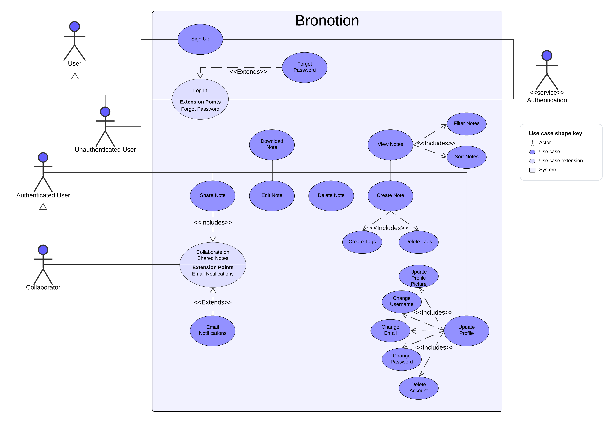

# Bronotion

### CS343 Stellenbosch University  
**Group 37**

| **Name**          | **Student Number** |
|-------------------|--------------------|
| Justin Dietrich   | 25924958           |
| Jonathan Donald   | 25957848           |
| James Milne       | 25917307           |
| Kellen Mossner    | 26024284           |
| David Nicolay     | 26296918           |

---

## 1. Introduction

Introduction

This report documents the development process and outcomes of Project 2 for Computer Science 343. Our group developed Bronotion, a real-time collaborative note-taking web application, which is publicly hosted at bronotion.co.za. This app allows users to create and manage markdown-based notes, with additional features such as PDF downloads of markdown files and Google/GitHub sign-in support. 
 
We built Bronotion using React.js and Tailwind CSS for the front end, with a backend powered by Node.js and PostgreSQL. We implemented authentication mechanisms with both traditional login managed by us through our database and OAuth-based options for Google and GitHub.

This report includes:

Use case diagrams to illustrate the key user interactions within Bronotion.
Data models and database structures normalized to 3NF or BCNF to ensure data integrity.
A detailed explanation of authentication mechanisms, focusing on the differences between authentication (authn) and authorization (authz).
A high-level overview of design patterns employed for both the front-end and API layers.
A summary of Git practices, including branching strategies and individual contributions tracked through commits.

## 2. Use case diagram

## 3. Data Modelling

## 4. Operating Environment and major dependencies
### Deployment
//TODO: justin please explain how we deployed on digital ocean.

### Tech Stack:
#### Frontend
The frontend of the Bronotion project is built using modern web development technologies to ensure a responsive and interactive user experience. Here are the key components:

- React.js: A popular JavaScript library for building user interfaces, particularly single-page applications where data changes dynamically.
- Next.js: A React framework that enables server-side rendering and static site generation, improving performance and SEO.
- shadcn/ui: An open source user interface library for building modern web apps with React and Tailwind CSS. 
- Tailwind CSS: A utility-first CSS framework that allows for rapid UI development with a consistent design system.
- Radix UI: A set of low-level, accessible UI components for building high-quality design systems and web applications.
- Lucide Icons: A collection of simple and consistent icons used throughout the application.
- TypeScript: A statically typed superset of JavaScript that enhances code quality and developer productivity.
- ESLint: A tool for identifying and fixing problems in JavaScript code, ensuring code quality and consistency.

#### Backend
The backend of the Bronotion project is designed to handle data storage, authentication, and business logic. It leverages robust and scalable technologies:

- Node.js: A JavaScript runtime built on Chrome's V8 engine, used for building fast and scalable server-side applications.
-Express.js: A minimal and flexible Node.js web application framework that provides a robust set of features for web and mobile applications.
- PostgreSQL: A powerful, open-source relational database system that supports advanced data types and performance optimization.
- Prisma: An ORM (Object-Relational Mapping) tool that simplifies database access and management with a type-safe API.
- OAuth: An open standard for access delegation, used for secure authorization with third-party services like Google and GitHub.

### Major dependencies:
#### Frontend
1. @auth/core: Core authentication library.
2. @babel/core: Babel compiler core.
3. @babel/runtime: Babel runtime helpers.
4. @next/env: Next.js environment configuration.
5. @next/eslint-plugin-next: ESLint plugin for Next.js.
6. @radix-ui/react-alert-dialog: Radix UI component for alert dialogs.
7. @radix-ui/react-avatar: Radix UI component for avatars.
8. @radix-ui/react-checkbox: Radix UI component for checkboxes.
9. @radix-ui/react-dialog: Radix UI component for dialogs.
10. @radix-ui/react-dropdown-menu: Radix UI component for dropdown menus.
11. @radix-ui/react-popover: Radix UI component for popovers.
12. @radix-ui/react-scroll-area: Radix UI component for scroll areas.
13. @radix-ui/react-select: Radix UI component for select dropdowns.
14. @radix-ui/react-tabs: Radix UI component for tabs.
15. @radix-ui/react-toast: Radix UI component for toasts.
16. axios: Promise-based HTTP client for the browser and Node.js.
17. clsx: Utility for constructing className strings conditionally.
18. cors: Middleware for enabling Cross-Origin Resource Sharing.
19. date-fns: Modern JavaScript date utility library.
20. dotenv: Module for loading environment variables from a .env file.
21. eslint: Pluggable JavaScript linter.
22. next: React framework for server-side rendering and static site generation.
23. react: JavaScript library for building user interfaces.
24. react-dom: Entry point of the DOM-related rendering paths.
25. typescript: Statically typed superset of JavaScript.

#### Backend
1. @prisma/client: ORM for database access and management.
2. bcrypt: Library for hashing passwords.
3. body-parser: Middleware for parsing incoming request bodies.
4. cors: Middleware for enabling Cross-Origin Resource Sharing.
5. express: Web application framework for Node.js.
6. formidable: Module for parsing form data, especially file uploads.
7. jsonwebtoken: Library for creating and verifying JSON Web Tokens.
8. pg: PostgreSQL client for Node.js.
9. prisma: ORM tool for database access and management.

## 5. Authentication

## 6. A high-level description of design patterns for the client and API

For the client-side architecture, we employed the approach of a modular component-based design. This ensured an organized codebase along with keeping our pages modular. The reposity was also structured into separate backend and client directories which divided the codebase up logically. 

We focused on ensuring our backend API was secure, with authorization checks being performed through middleware functions. Certain endpoints marked with [Auth Req] in the API Documentation ensures that users have the correct access rights for endpoints. We put ensuring the API is RESTful at the forefront of our design.

#### TODO ADD MORE

## 7. Additional Features

### 1. Host application on public-facing server: [bronotion.co.za](http://bronotion.co.za).

We deployed the Bronotion application on a public-facing server using DigitalOcean. We also purchased the domain name bronotion.co.za for this deployment.

### 2. Lost passwords reset via email, email notification sent when note shared.

If a user forgets their password, they can enter their email address and request a password reset email to be sent to them. From this email, they can access a specific webpage to  reset their password. When users share their notes, email notifications are sent to the recipients, along with a link to view the shared note.

### 3. PDF download of markdown notes.

Users can download a PDF version of their markdown notes directly to their device from their dashboard.

### 4. Google and GitHub OAuth signin.

We implemented OAuth-based sign-in options for both Google and GitHub. This allows users to swiftly signin to the webapp without needing to create a new account. Allowing for both GitHub and Google sign-in expands the possible user base and makes the app more accessible.
